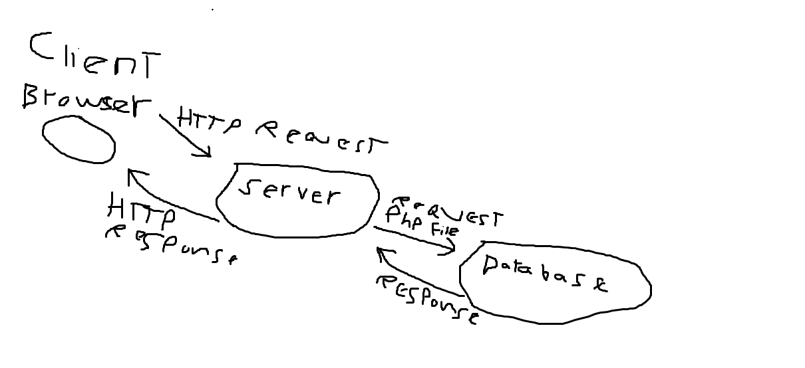

# City Explorer

**Author**: Steve Ngo
**Version**: 1.0.0 (increment the patch/fix version number if you make more commits past your first submission)

## Overview
<!-- Provide a high level overview of what this application is and why you are building it, beyond the fact that it's an assignment for this class. (i.e. What's your problem domain?) -->

## Getting Started
<!-- What are the steps that a user must take in order to build this app on their own machine and get it running? -->

## Architecture
<!-- Provide a detailed description of the application design. What technologies (languages, libraries, etc) you're using, and any other relevant design information. -->

## Change Log
<!-- Use this area to document the iterative changes made to your application as each feature is successfully implemented. Use time stamps. Here's an example:

00-00-2021 4:59pm - Application now has a fully-functional express server, with a GET route for the location resource. -->

## Credit and Collaborations
<!-- Give credit (and a link) to other people or resources that helped you build this application. -->

> Collaboration with Kirk Garrison

> Collaboration with Rayan Hoffman

[web request-response cycle](public/day3.png)
> Collaboration with nobody

> Collaboration with Samuel Panek

## Time Estimates
### Name of feature: 6.1 Set up your React repository & API keys.

Estimate of time needed to complete: 30 min

Start time: 12:30 Am

Finish time: 01:00 Am

Actual time needed to complete: 30 min

### Name of feature: 6.2 Locations

Estimate of time needed to complete: 30 min

Start time: 04:00 Am

Finish time: 07:20 Am

Actual time needed to complete: 03 hr 20 min

### Name of feature: 6.3 Map

Estimate of time needed to complete: 20 min

Start time: 07:20 Am

Finish time: 07:28 Am

Actual time needed to complete: 08 min

### Name of feature: 6.4 Error

Estimate of time needed to complete: 20 min

Start time: 07:28 Am

Finish time: 07:30 Am

Actual time needed to complete: 02 min

### Name of feature: 7.2 Weather (placeholder)

Estimate of time needed to complete: 1 hr

Start time: 00:00 Am

Finish time: 00:00 Am

Actual time needed to complete: 

### Name of feature: 7.3 Errors (revisited)

Estimate of time needed to complete: 00 min

Start time: 00:10 Am

Finish time: 00:00 Am

Actual time needed to complete: 00 min